# Title: Client Scheduling Application
- Author: Dominic Payer
- Version No: 1.0
- As of: 02/26/2023

# Dependencies:
- IDE: IntelliJ IDEA 2022.1.2 (Community Edition)
- JDK: Java FJK 17.0.5
- FX: JavaFX FXML 17.0.1
- DB: MySQL Workbench v.8.0.32
- Driver: MySQL Connector/J v.8.0.32

# Scenario
You are working for a software company that has been contracted to develop a GUI-based scheduling desktop application. The contract is with a global consulting organization that conducts business in multiple languages and has main offices in Phoenix, Arizona; White Plains, New York; Montreal, Canada; and London, England. The consulting organization has provided a MySQL database that the application must pull data from. The database is used for other systems, so its structure cannot be modified. An example of a typical user is a secretary who is responsible for scheduling customer appointments to meet with professional contacts within their organization.

# Features
## Login Page:
- Displays user timezone by detecting their system default zone ID
- Text displayed in either english or french depending on their system zone ID
- validates user login using db queries

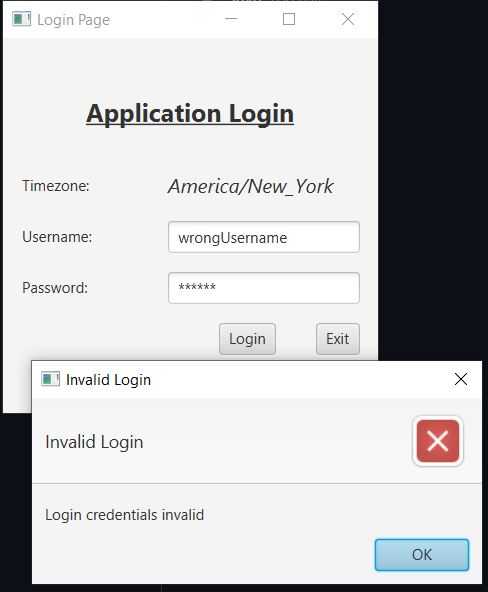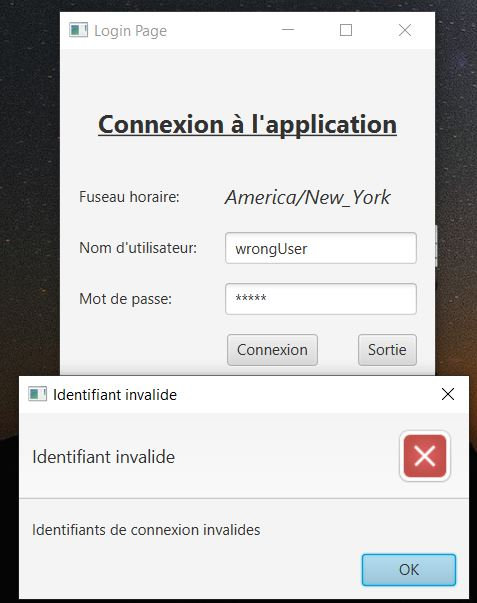

## Dashboard:
- Displays user timezone and user greeting depending on logged in username
- Provides the navigation to each page in the application
- displays a heads up warning on the dash and as a pop-up if there are upcoming appointments within a time period
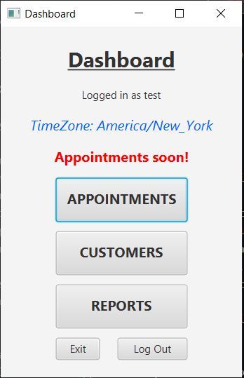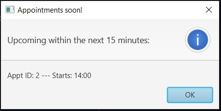

## Appointments/Add Appointments/Update Appointments
- can add, update, or delete appointments (requires user confirmation via dialog box)
- dropdown selection GUI elements are prepopulated using database queries for those respective elements
- updating an appointment prepopulates the data fields with the current appointment data to be modified
- Appointments are assigned a start datetime and end datetime, which must fall within business hours (business hours are 8am-10pm est and are automatically converted to reflect their local representative times based upon the user timezone
- Appointments cannot be scheduled outside business hours or overlap other appointments for that customer, an attempt to do so is met with an error dialog box
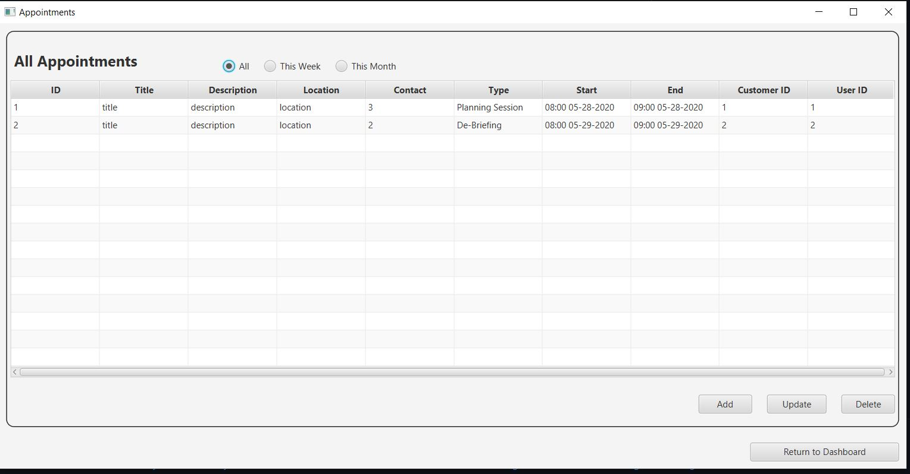
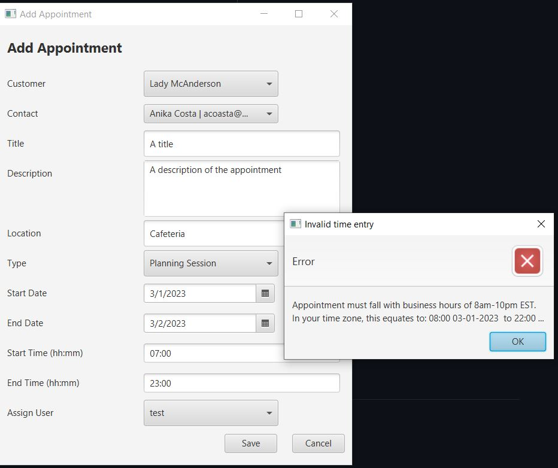

## Customers/Add Customer/Update Customer
- can add, update, or delete customers (requires user confirmation via dialog box)
- with user confirmation, deleting a customer also deletes any associated customer appointments
- dropdown selection GUI elements are prepopulated using database queries for those respective elements and are reactive (ex. selecting a Country for a customer will reactively filter the selection for Division data, such as selecting USA will populate the division data as 50 states)
- updating a customer prepopulates the data fields with the current customer data to be modified
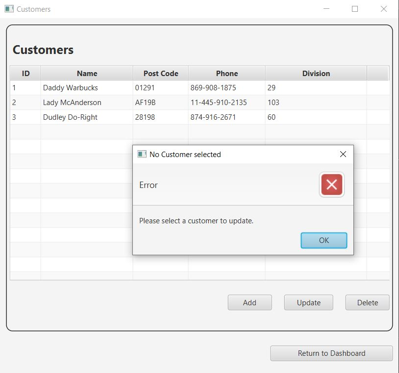
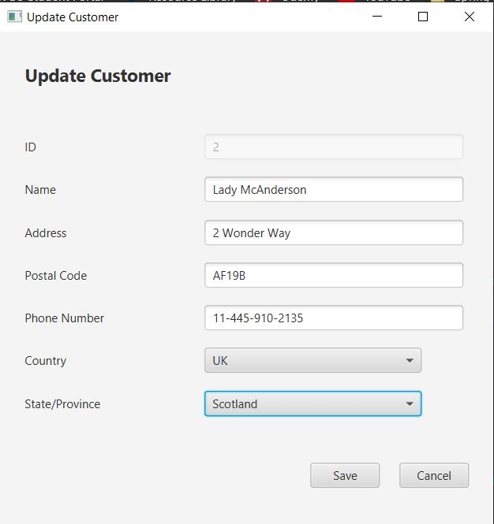
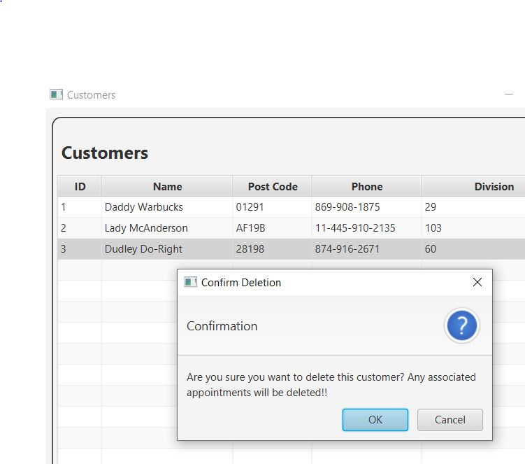

## Reports Page:
- the total number of appointments, filterable by month and type
- the busiest month (has the most appointments)
- the busiest Contact (has the most appointments)
- generate a schedule for a selected Contact (directs to the Contact Schedule page)
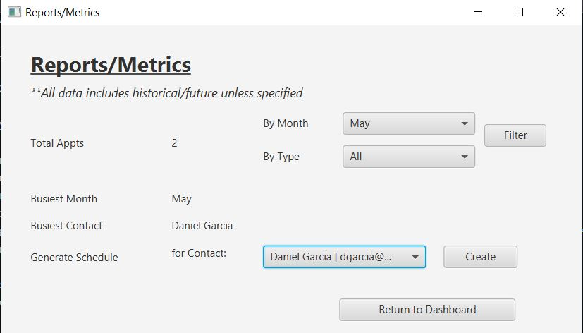
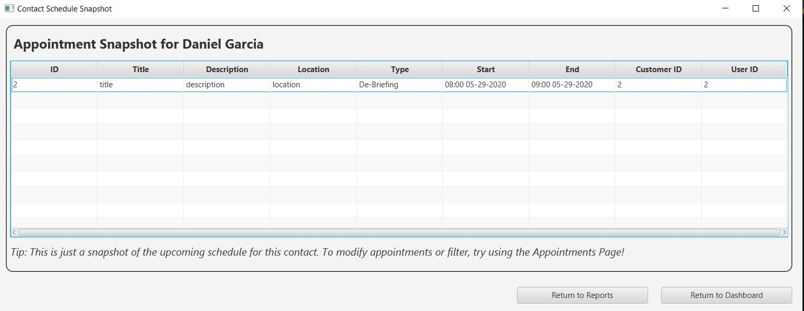
